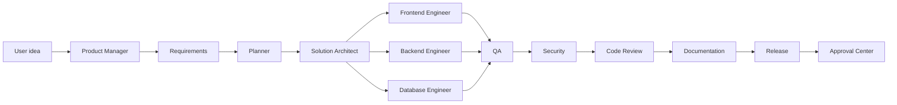

# Agent Network

Each agent has a role, goals, tools, outputs, action logs, and decision reports. Agent decisions are written to the audit log.

| Agent | Responsibility | Key Outputs |
| --- | --- | --- |
| Product Manager Agent | Product brief, success metrics, MVP boundaries, release risks | `product_brief.md`, `success_metrics.json` |
| Requirements Agent | Functional and non-functional requirements, clarification gating, user stories, acceptance criteria, edge cases | `requirements.md`, `acceptance_criteria.json`, `user_stories.json` |
| Planner Agent | Task decomposition, dependency graph, approval gates | `plan.json`, `timeline.md` |
| Solution Architect Agent | Architecture, domain model, contracts, module boundaries, API shape | `architecture.md`, `api_contract.yaml`, `domain_model.json` |
| Frontend Engineer Agent | Next.js, React, TypeScript, Tailwind, Zustand, React Query | `apps/web`, frontend tests |
| Backend Engineer Agent | FastAPI services, schemas, endpoints, integration tests | `apps/api`, backend tests |
| Database Engineer Agent | PostgreSQL schema, SQLAlchemy models, migrations | schema and migrations |
| DevOps Agent | Docker, lifecycle scripts, environment checks, deployment bundle | `docker-compose.yml`, PowerShell scripts |
| QA Agent | Unit, integration, and E2E quality gates | `test_report.json`, `qa_summary.md` |
| Security Agent | Code, dependency, endpoint, auth, RBAC, tenancy, billing, and secret review | `security_review.md`, `threat_model.md` |
| Documentation Agent | User, developer, architecture, troubleshooting, deployment, readiness, compliance, and integration docs | README and architecture docs |
| Code Review Agent | Diff review, maintainability, tests, standards, retry-failure summaries | `review.md`, findings |
| Release Agent | Release notes, deployment package, rollback notes, human escalation summary when needed | changelog and release bundle |
| Product Review Agent | Blocks weak product plans and requests refinement when buyer, value, pricing, or MVP are unclear | `product_review.json`, `required_refinements.md` |
| Meta Review Agent | Reviews all agent outputs against senior gates, scorecards, evidence, and release policy | `meta_review.json`, `senior_review_summary.md` |

## Agent Flow

## Decision Reporting

The runtime sends each agent a role-specific prompt and records:

- agent name
- role
- decision text
- expected outputs
- provider and model
- context keys
- UTC timestamp

## Tool Boundaries

Agents do not directly write files or execute commands. They propose work through:

- Workspace manager
- Diff manager
- Approval center
- Docker sandbox manager
- Git manager
- Test runner workflow
- Audit logger

## Refinement and Correction

The network now includes a requirement-refinement engine that generates domain models, user stories, acceptance criteria, edge cases, API contracts, and test cases before implementation. Clarifying questions are reserved for genuinely ambiguous product category, billing, tenancy, or integration choices.

The old "infinite correction" concept is now named the configurable correction loop. It runs real build/test checks, requests Qwen unified diffs when deterministic fixes are insufficient, validates diffs before applying, retries with exponential backoff, records `.aen/retry-history.json`, and escalates to a human after `AEN_MAX_REPAIR_ATTEMPTS`.

## Senior Agent Contract

Each agent now carries an input schema, output schema, validation logic, quality rubric, failure modes, retry policy, and escalation rules. The runtime includes those contracts in the agent system prompt, and the Meta Review Agent checks consistency across outputs before release readiness.
