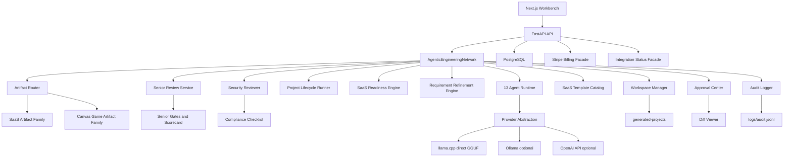
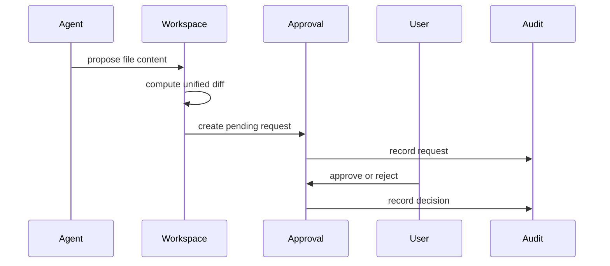

# Architecture

Agentic Engineering Network is a local, Docker-first, approval-gated engineering platform.

## System Diagram

## Backend

- FastAPI exposes `/api/health`, `/api/agents`, `/api/runs`, `/api/approvals`, and `/api/logs/audit`.
- The orchestrator decomposes ideas, runs all registered agents, creates proposed artifacts, scans for secrets, and queues approvals.
- Artifact generation goes through an intent router before template selection. SaaS prompts use the SaaS production artifact family; game prompts use a playable canvas game artifact family; future artifact families should be added behind the router.
- After approval gates are resolved, the project lifecycle runner validates generated files, builds the generated Docker Compose stack, starts it on isolated ports, checks API/Web health live, runs API pytest, runs the web production build, requests Qwen unified-diff repairs when failures remain, writes a per-project sandbox manifest, runs security review, and creates a release ZIP.
- The configurable correction loop records retry history, applies exponential backoff, writes a failure summary, and escalates to a human engineer after the configured limit.
- SaaS readiness, compliance, integration status, Stripe billing status, SaaS templates, and requirement refinement are exposed as first-class API modules.
- Senior review is split into domain quality primitives and application services, then exposed through API/UI contracts.
- SQLAlchemy models and PostgreSQL schema are included for persistence expansion.
- Generated applications include production-oriented modules for Stripe billing, tenant context enforcement, RBAC permissions, workflow evaluation, signed integrations, security headers, and compliance documentation.

## Frontend

- Next.js app router
- React and TypeScript
- Tailwind CSS
- Zustand for active workbench state
- React Query for server state
- Lucide icons

The first screen is the workbench: chat, project explorer, generated files, diff viewer, terminal output, logs, agent activity, timeline, security summary, approval center, and production-readiness dashboard.

## Security Architecture

Security rules:

- No source-code secrets.
- No generated writes without diff review.
- No package installation without approval.
- No shell execution without approval.
- No deployment without approval.
- Host service startup is blocked when Docker is unavailable.
- Model-generated repairs are accepted only as unified diffs and must pass `git apply --check` before they can change generated project files.
- The repair loop is configurable through `AEN_MAX_REPAIR_ATTEMPTS`; the runtime caps it to avoid infinite host resource consumption.
- Stripe is mock-first unless real test or live keys are provided through environment variables.
- External providers are abstracted behind configuration checks; missing providers degrade to mock/local modes instead of using placeholder secrets.

## Production Modules

| Module | Purpose |
| --- | --- |
| SaaS readiness | Launch checklist for validation, pricing, onboarding, billing, observability, support, and deployment |
| Compliance | GDPR, SOC2-lite, ISO27001-lite, accessibility, privacy, retention, audit, consent, and legal-review tracking |
| Requirement refinement | Domain model, user stories, acceptance criteria, edge cases, API contracts, and test-case generation |
| Artifact router | Classifies the requested project family before generation so incompatible templates are not silently used |
| SaaS templates | CRM, ecommerce, booking, LMS, marketplace, admin dashboard, and AI chatbot starting points |
| Game templates | Playable browser canvas projects with score, AI behavior, controls, tests, Docker, and desktop packaging scaffolding |
| Billing facade | Stripe checkout, portal, webhook handling, and mock mode |
| Integration facade | Email, payments, analytics, storage, auth, and notifications health/status abstraction |
| Senior review | Product, requirements, architecture, security, QA, compliance, release gates and scorecards |

## Clean Architecture Boundaries

- Domain: `packages/orchestration/.../domain/quality.py`
- Application: `packages/orchestration/.../application/*`
- Infrastructure: Docker, Git, logs, billing, integrations, compliance evidence
- Interface/API: `apps/api/app/api/routes.py` and Pydantic schemas
- UI: `apps/web/src/components`

## Provider Layer

The provider abstraction supports:

- Direct GGUF inference through `llama-cpp-python`
- `llama_cpp` as the default local provider
- CUDA GPU offload for local Qwen inference when Docker Desktop exposes NVIDIA GPUs
- Ollama as an optional local provider
- OpenAI API as an optional provider
- deterministic local fallback for offline planning and tests

## Data and Logs

- `logs/audit.jsonl`: approval, agent, and run events
- `data/runs`: persisted run records and execution results
- `data/postgres`: PostgreSQL Docker volume
- `data/ollama`: Ollama Docker volume
- `generated-projects`: generated project proposals and future approved outputs
