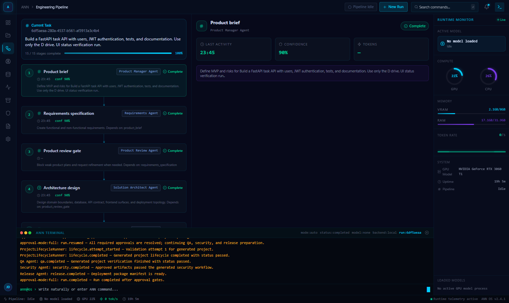
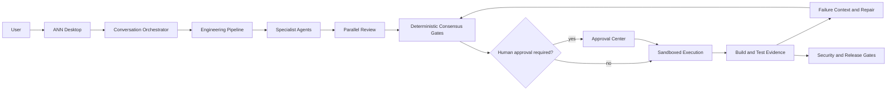

# ANN: Agentic Neural Network

**A local-first, approval-gated operating system for AI-assisted software engineering.**

ANN turns a natural-language product request into a traceable engineering run:
requirements, architecture, implementation proposals, tests, security review,
consensus, controlled patch application, verification, and release artifacts.
It runs on the user's machine, exposes its decisions, and keeps humans in
control of consequential actions.

> **Status: public alpha.** ANN is a substantial working system and research
> portfolio project, not a guarantee that one prompt will produce production-
> ready or commercially successful software. Generated code requires review.



## Why ANN Exists

Most coding assistants optimize a single model response. ANN treats software
delivery as a stateful system problem: multiple specialist roles exchange
structured artifacts, deterministic gates arbitrate disagreements, runtime
evidence outranks stylistic opinion, and unresolved ambiguity escalates to a
human rather than looping forever.

## What Works Today

- Native Windows desktop shell plus a local Next.js engineering workbench.
- Natural-language conversation handoff into a real multi-stage run.
- Product, requirements, planning, architecture, frontend, backend, database,
  DevOps, QA, security, documentation, review, meta-review, and release roles.
- Supervised and full-approval modes with persistent audit evidence.
- Proposed diffs before writes, patch quality gates, token confirmation, safe
  terminal allowlists, protected paths, and workspace traversal defenses.
- Sequential local model routing with at most one loaded model at a time.
- Qwen 3 for conversation/product work, Qwen2.5-Coder for implementation, and
  DeepSeek-R1-Distill-Qwen for powerful review when locally configured.
- Failure Context Compiler for bounded, targeted repair payloads.
- Cross-domain root-cause isolation across source, tests, Docker, YAML, SQL,
  migrations, package metadata, environment contracts, and infrastructure.
- Test Validity Gate that can classify a failing assertion as suspect instead
  of blindly rewriting valid implementation code.
- Product Contract Arbitration with deterministic evidence priority and human
  escalation when the contract is ambiguous.
- Consensus policy that suppresses stylistic bikeshedding when functionally
  valid options are equivalent.
- Bounded autonomous correction, retry history, exponential backoff, safe
  rollback, and `FAILED_PERMANENTLY` escalation.
- Architecture entropy analysis to detect accumulated complexity and propose
  explicit refactoring work instead of endlessly adding local conditionals.
- Project templates, Docker validation, health checks, security scans,
  documentation, packaging, and generated-project lifecycle artifacts.

## Architecture



Model execution is sequential by policy:

```text
load one model -> run one stage -> capture metrics -> unload -> verify zero loaded models
```

ANN does not bundle model weights. Operators provide local model files and
configure their paths explicitly.

## Safety Model

ANN separates language-model suggestions from authority:

1. Agents propose structured outputs and diffs.
2. Deterministic policy validates scope, paths, approvals, and runtime state.
3. Supervised mode pauses before writes, commands, installs, or deployment.
4. Execution is constrained to approved workspaces and allowlisted operations.
5. Every decision and retry produces auditable artifacts.
6. Ambiguous contracts, invalid tests, repeated failures, or unsafe paths stop
   the loop and require human review.

No autonomous system can make arbitrary generated code safe. Run ANN in a
disposable workspace, inspect patches, and perform independent security and
legal review before production use.

## Repository Layout

```text
agentic_network/   Core agents, gates, runtime, memory interfaces, and safety
apps/api/          FastAPI service
apps/web/          Next.js/React engineering workbench
apps/desktop/      Native desktop shell
packages/          Shared orchestration, sandbox, Git, logs, DB, and security
config/            Portable runtime and routing policy
installer/         Windows install, uninstall, signing, and validation scripts
scripts/           Setup, maintenance, release, and runtime utilities
tests/python/      Runtime, safety, orchestration, and desktop test suite
docs/              Architecture, skills, runtime, storage, and operations docs
```

Private model weights, adapters, datasets, conversations, memory, generated
projects, runtime databases, logs, and historical outputs are deliberately
excluded from the public repository.

## Requirements

- Windows 11
- PowerShell 5.1+
- Python 3.11+
- Node.js 22 LTS
- Git
- Docker Desktop for container-backed project validation
- NVIDIA GPU recommended for local inference
- User-supplied GGUF/Hugging Face models where applicable

WSL2 is supported for an external CUDA-enabled Python runtime. A configured
Windows runtime may also be used. Cloud APIs are optional, not required.

## Quick Start From Source

```powershell
git clone https://github.com/ThatYakuzaGuy/agentic-neural-network.git D:\AgenticEngineeringNetwork
Set-Location D:\AgenticEngineeringNetwork
Copy-Item .env.example .env
.\setup.ps1
.\start.ps1
```

Open the packaged desktop shell when available, or use the local workbench at
`http://127.0.0.1:3000`. API health is exposed at
`http://127.0.0.1:8000/api/health`.

The portable runtime example in
`config/ann_terminal_conversation_runtime.json` disables real inference by
default. Configure a local Python executable and model paths, then deliberately
enable inference after validating GPU support.

Install the optional Python model backend only in a trusted local environment:

```powershell
python -m pip install -e ".[local-models]"
```

## Development Verification

```powershell
python -m ruff check agentic_network packages tests/python scripts
python -m pytest tests/python -q
npm ci
npm --workspace apps/web run lint
npm --workspace apps/web run test
npm --workspace apps/web run build
```

The release process also verifies a fresh exported clone, scans for secrets,
rejects large model artifacts, and records SHA-256 hashes in a public release
manifest.

## Evidence and Documentation

- [Architecture](ARCHITECTURE.md)
- [Agent responsibilities](AGENTS.md)
- [Security policy](SECURITY.md)
- [Dependency security](docs/DEPENDENCY_SECURITY.md)
- [Known limitations](LIMITATIONS.md)
- [Public release process](docs/PUBLIC_RELEASE.md)
- [Model backend configuration](README_LOCAL_MODEL_BACKENDS.md)
- [Storage behavior](docs/STORAGE.md)
- [Contributing](CONTRIBUTING.md)

## Honest Limitations

- ANN does not guarantee a sellable product from one prompt.
- Local model quality, latency, and context capacity depend on hardware and the
  models supplied by the operator.
- Deep domain behavior, production operations, compliance, UX validation, and
  external accounts still require qualified humans.
- The current desktop distribution is unsigned unless the release maintainer
  supplies a trusted code-signing certificate; Windows may show SmartScreen.
- Some project types need additional artifact families and domain-specific
  tools beyond the current SaaS, API, and canvas-game foundations.
- Autonomy is intentionally bounded. “Infinite correction” would be unsafe and
  is implemented as a configurable retry loop with escalation.

## License

ANN source code is released under the [MIT License](LICENSE). Third-party
components remain under their respective licenses; see [ATTRIBUTIONS.md](ATTRIBUTIONS.md).
