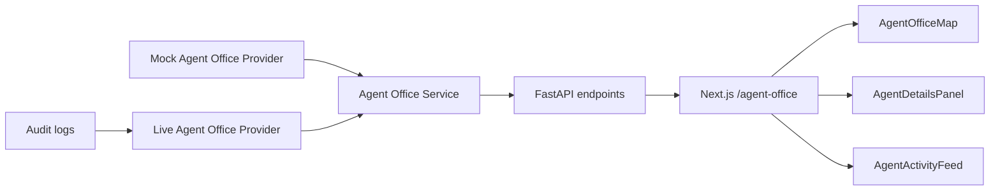

# Agent Office Visualizer

## Purpose

Agent Office Visualizer is a pixel-office inspired dashboard for watching the multi-agent engineering network work in real time. It turns agent activity, approval gates, QA checks, review events, and release activity into a small software-company office map.

The visualizer is original HTML/CSS/React UI. It does not use paid assets and does not copy reference art.

## Routes And Endpoints

- Frontend route: `/agent-office`
- State endpoint: `GET /api/agent-office/state`
- Events endpoint: `GET /api/agent-office/events`
- Optional live stream: `GET /ws/agent-office` as a WebSocket

The frontend polls `/api/agent-office/state` every two seconds. The WebSocket endpoint sends the same state payload and can replace polling later.

## Architecture

The provider abstraction lives in `apps/api/app/services/agent_office.py`.

- `LiveAgentOfficeProvider` maps existing audit events to agent state.
- `MockAgentOfficeProvider` returns deterministic demo data when no live activity is available.
- `AgentOfficeService` exposes a stable state/events contract for routes and WebSocket.

## Data Model

Each agent contains:

- `id`
- `name`
- `role`
- `status`
- `currentTask`
- `progress`
- `position`
- `deskId`
- `lastActivityAt`
- `events`
- `confidence`
- `blockedReason`
- `approvalRequired`

Supported statuses:

- `idle`
- `thinking`
- `planning`
- `coding`
- `testing`
- `reviewing`
- `blocked`
- `waiting approval`
- `completed`
- `failed`

## Displayed Agents

- Product Manager
- Requirements Agent
- Planner
- Architect
- Frontend Engineer
- Backend Engineer
- Database Engineer
- DevOps Engineer
- QA Engineer
- Security Engineer
- Compliance Agent
- Documentation Agent
- Release Agent
- Meta Review Agent

## Connecting Live Agent Events

Live mapping currently reads `logs/audit.jsonl` through `AuditLogger.tail()`.

To connect richer live data later:

1. Emit audit events with the agent name in `actor`.
2. Use specific event types such as `agent.started`, `agent.decision`, `qa.completed`, `security.completed`, `approval.requested`, and `sandbox.command.completed`.
3. Add new actor aliases in `ACTOR_ALIASES` if a new agent name does not map cleanly.
4. Expand `_status_from_event()` for new event categories.

## Customizing Office Layout

The default pixel office coordinates are defined in `OFFICE_LAYOUT`.

To move a desk:

1. Edit the agent's `OfficePosition(x, y)`.
2. Keep coordinates inside the office size returned by the provider.
3. Run frontend type checks and component tests.

The React map is rendered by `AgentOfficeMap`. The CSS art is in `apps/web/src/app/globals.css`.

## Adding New Agents

1. Add a new item to `OFFICE_LAYOUT`.
2. Add actor aliases to `ACTOR_ALIASES`.
3. Add status handling if the agent needs custom behavior.
4. Update tests that assert the expected agent count.
5. If the agent is user-created, wire the Add Agent button to a persistent settings endpoint.

## Limitations

- The UI currently uses polling by default; WebSocket streaming exists but is not yet the frontend default.
- The Add Agent, Layout, and Settings buttons are UI controls/placeholders for future persistent configuration.
- Live status inference is heuristic and based on audit event text/type.
- The visualizer shows operational state; it does not prove agent output correctness.
- Pixel art is CSS-generated and intentionally lightweight rather than a full game engine.
