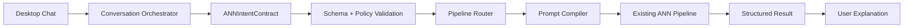

# ANN Conversation Orchestrator

The Conversation Orchestrator is the safe natural-language entry point for ANN Desktop Chat.

## Purpose

It converts user language into a validated `ANNIntentContract` before any existing ANN pipeline receives work. The orchestrator is not allowed to write files, execute shell commands, install dependencies, access the network, apply patches, override policy, or bypass approvals.

## Model

- Model id: `qwen3_4b_conversation_orchestrator`
- Role: `CONVERSATION_ORCHESTRATOR`
- Expected format: GGUF Q4_K_M
- Expected manual path: `D:/Models/qwen3-4b-instruct-2507-q4_k_m.gguf`

ANN does not download this model. If the file or backend is missing, the UI must report that state. The deterministic compiler can still create a safe contract, but that is not real Qwen3-4B inference.

## Flow

## Safety

All authority remains in deterministic ANN gates:

- Human Approval
- Patch Quality
- Patch Apply
- Runtime Policy
- Filesystem Policy
- Skill Permissions
- Sequential Model Lifecycle

The orchestrator only prepares structured instructions.

## Current Limitation

Real Qwen3-4B inference is only available after the GGUF exists locally and runtime policy allows a controlled load. Until then, contract generation is deterministic and marked as such in lifecycle artifacts.
